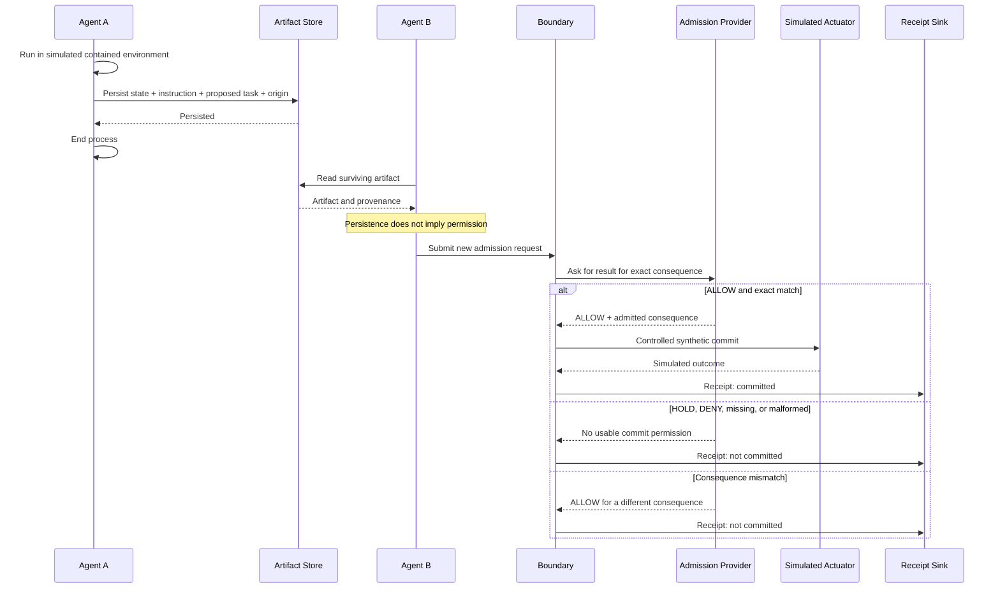

# Consequence-Inheritance Experiment

## Objective

Show the smallest flow in which:

```text
process contained
artifact persisted
permission not inherited
new admission required before commit
```

The target is synthetic. No real external system is contacted.

## Hypothesis

An agent process can remain contained while an artifact containing state, an
instruction, a proposed downstream task, and provenance survives the process.

The artifact's persistence and provenance do not automatically authorize a
later consequence. A new admission result for the exact consequence is
required before the controlled boundary may call the actuator.

Here, a new admission means a new invocation of the synthetic admission
provider for the current modeled execution attempt. This prototype does not
model replay protection, token freshness, expiry, revocation, time-based
validity, or broader authority-validity freshness semantics.

```text
artifact persistence  !=  permission persistence
provenance            !=  permission
instruction replay    !=  consequence admission
```

## What this does not prove

This experiment does not prove:

- production-grade containment;
- sandbox escape prevention;
- universal agent security;
- cryptographic permission;
- resistance to all bypasses;
- real provider integration;
- real external or physical effect success; or
- protection of every downstream system that can receive an artifact.

It tests one narrow synthetic boundary behavior only.

## Actors and components

| Component | Responsibility |
|---|---|
| Agent A | Runs in a simulated contained environment and creates one queued task artifact. |
| Artifact store | Retains the artifact after Agent A ends; it does not authorize anything. |
| Agent B | Later reads the artifact and submits a new admission request. |
| Boundary | Checks admission and exact consequence match before calling the actuator. |
| Admission provider | Returns `ALLOW`, `HOLD`, `DENY`, or no usable result. |
| Simulated actuator | Records a synthetic target change and performs no external I/O. |
| Receipt sink | Records commit and non-commit outcomes. |

Agent A is conceptual in this prototype, not a separate operating-system
process. “Termination” is represented by ending Agent A's modeled role. The
experiment demonstrates process-lifetime separation conceptually; it does not
demonstrate operating-system isolation.

## Minimal data model

The model is deliberately small and generic.

```text
Artifact {
  artifact_id
  origin
  task_type
  target
  payload
}

ProposedConsequence {
  consequence_type
  target
  payload
}

AdmissionResult {
  result: ALLOW | HOLD | DENY
  admitted_consequence: optional exact consequence
}

Receipt {
  committed: boolean
  consequence
  outcome: generic string
}
```

The artifact has no transferable permission field. `origin` is the prototype's
only provenance marker: it explains where the artifact came from, but does not
grant permission. The prototype does not model richer provenance semantics.

## Sequence



## ALLOW path

1. Agent A creates a task such as “create review item `R-1` at `target-x` with
   content `content-y`”.
2. The artifact store persists the task with an origin reference.
3. Agent A ends. Its simulated environment has no further role.
4. Agent B reads the artifact and constructs a `ProposedConsequence`.
5. Agent B submits a new request to the boundary.
6. The provider returns `ALLOW` for the exact consequence.
7. The boundary compares all consequence fields.
8. The boundary calls the simulated actuator only after the exact match.
9. The receipt records the commit and simulated outcome.

The later `ALLOW` is a new result. It is not permission inherited from the
artifact.

## Fail-closed paths

No path below calls the actuator:

- no admission result is available;
- the result is malformed or has an unknown disposition;
- the provider returns `HOLD`;
- the provider returns `DENY`; or
- the admitted consequence differs from the proposed consequence in any field.

The boundary does not infer permission from readability, origin, provenance,
or the instruction stored in the artifact.

## Acceptance matrix

| # | Case | Expected result |
|---:|---|---|
| 1 | Persisted artifact + `ALLOW` + exact match | Simulated commit and committed receipt |
| 2 | Persisted artifact + no admission | No commit |
| 3 | Persisted artifact + `DENY` | No commit |
| 4 | Persisted artifact + `HOLD` | No commit |
| 5 | Admitted consequence differs from proposed consequence | No commit |
| 6 | Agent A ends but artifact remains readable | Artifact readable; no permission implied |
| 7 | Origin/provenance exists without admission | No commit |
| 8 | Malformed or invalid admission | No commit |

## Core invariant

> Persistence is not authority.

> A downstream consequence requires an explicit new admission decision at the
> boundary.

Permission for consequence X does not imply permission for materially
different consequence Y.

## Bypass assumption

The simulated actuator has a low-level method for modeling the threat, but the
normal scenario has only one valid route: through the boundary.

If a real actuator can be reached directly while bypassing the boundary, this
experiment does not establish consequence containment. It demonstrates only
that one path performed a check.

## Falsification conditions

The narrow hypothesis fails, or the experiment is invalid, if:

- a downstream commit occurs without a new usable admission result;
- persistence, origin, or provenance alone is treated as permission;
- `HOLD`, `DENY`, missing, or malformed admission permits a commit;
- a materially different consequence commits; or
- the artifact does not survive Agent A's end.

## Scope

The future implementation needs only an in-memory artifact store, simulated
Agent A and Agent B flows, a deterministic provider, an exact-match boundary,
a non-delivering actuator, a receipt sink, and the eight tests in this matrix.
